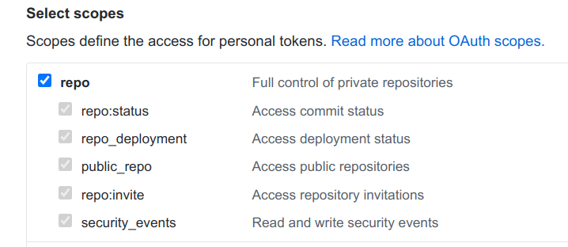

# Using SURF HPC Cloud

This guide assumes that the user already has a VM running on [SURF HPC Cloud](https://www.surf.nl/en/hpc-cloud-your-flexible-compute-infrastructure).

We will use an Ansible playbook to install a [GitHub Action runner](https://help.github.com/en/actions/hosting-your-own-runners) on it. When done a GitHub action workflow configured with `runs-on: self-hosted` will run on that runner in the VM.

## Prerequisites

* VM running on SURF HPC Cloud
* [Ansible](https://docs.ansible.com/ansible/latest/installation_guide/intro_installation.html),
    I suggest using a Python virtual environment and `pip install ansible`.

## Create a VM

To deploy the runner on SURF HPC Cloud, we need to create a Virtual machine (VM).
You can find the instructions [here](https://doc.hpccloud.surfsara.nl/).

## Set SSH keys for the VM

In order to access to VM, you will need to create ssh keys. Please see [this link](https://doc.hpccloud.surfsara.nl/SSHkey)

## Login to VM (optional)

If you want to test the connection with the VM, you can use the command below

```shell
ssh -i $YOUR_KEY_PATH -p 22 $USER@$HOSTNAME
```

In this command,

- `$HOSTNAME` is the IP address of the VM you created,
- `$YOUR_KEY_PATH` is the ssh key you generated in previous step.
- `$USER` is the posix user on the vm associated with the ssh key.

## Configuration

### Step-1 Creating the Ansible inventory file

To use Ansible you need an [inventory file](https://docs.ansible.com/ansible/latest/user_guide/intro_inventory.html). An example inventory file called `hosts.example` should be copied to `hosts` and updated to reflect your situation.

```shell
cp hosts.example hosts
```

Ansible playbook will ask for which GitHub account/organization and repository it should setup a runner for.

When Ansible command is executed, the Ansible playbook will ask for

- the user or rganization name
- the repository name

As a repository, you can use a clone of [https://github.com/ci-for-science/python-example1](https://github.com/ci-for-science/python-example1) or any repository which has a GitHub Action workflow that has [`runs-on: self-hosted`](https://github.com/ci-for-science/python-example1/blob/4dea9c4f32a9bfcfcf166eb631c7aed3b2097d6c/.github/workflows/ci.yml#L15).

### Step-2 Generating a Github Personal Access Token

The Ansible playbook uses Personal Access Token for GitHub account to register the runner.
The token needs to have full admin rights for the repo. The only scope needed is `repo          Full control of private repositories`.

[](https://github.com/settings/tokens)

 The token can be created [here](https://github.com/settings/tokens).

The generated token should be set as the `PAT` environment variable.

```shell
export PAT=xxxxxxxxxxxxxxx
```

## Install GitHub Action runner

### Step 1- Testing the connection with the server
To install GitHub Action runner we use an Ansible playbook to provision the VM.

To test the connection with the server, Ansible can run ping command.

```shell
ansible all -m ping
```

If it successfully connects to the server, the output should be something like

```shell
hpc | SUCCESS => {
    "changed": false,
    "ping": "pong"
}
```

### Step 2- Installing required Ansible dependencies

The playbook uses roles from [Ansible galaxy](https://galaxy.ansible.com/), they must be downloaded with

```shell
ansible-galaxy install -r requirements.yml
```

### Step 3- Provisioning (installation on the server)

To provision VM use

```shell
ansible-playbook playbook.yml
```

To view the log of the runner, you can connect to the server via ssh and run

```shell
journalctl -u actions.runner.*
```

## Uninstalling the runner

First unregister runner with

```shell
ansible-playbook playbook.yml --tags uninstall
```

## Examples:

- [Simple Python example](https://github.com/ci-for-science/example-python-1)

- [Simple GPU example](https://github.com/ci-for-science/example-gpu-houston)
