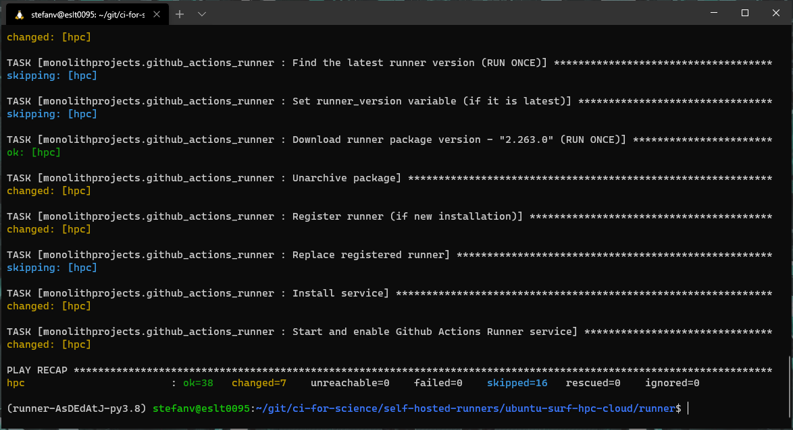

# Setup GitHub Action runner on a VM on SURF HPC Cloud from Windows

Most of the steps in [../ubuntu-surf-hpc-cloud/README.md](../ubuntu-surf-hpc-cloud/README.md) can be reused except for installing Ansible.

Ansible can not be initiated from Windows powershell or command prompt.
You will need to install Ansible in [Windows Subsystem for Linux (WSL)](https://docs.microsoft.com/en-us/windows/wsl/).

For installing Ansible on Windows see [../windows-vagrant/README.md](../windows-vagrant/README.md).

## Example run-through

[I](https://github.com/sverhoeven) used the [https://github.com/ci-for-science/example-gpu-houston](https://github.com/ci-for-science/example-gpu-houston) repo and a VM in the SURF HPC cloud to run a self hosted GitHub action runner. Through out the run-through I will use my account `sverhoeven` and `example-gpu-houston` as repo name, please replace with your account/repo for your own run-through. Below are screenshots of the run-through.

I was using Ubuntu 20.04 on WSL1 with Python 3.8.2 and Ansible v2.9.10.


> At the time the `sleep` command did not work, so I used [this](https://github.com/microsoft/WSL/issues/4898#issuecomment-642703700) workaround

I [duplicated](https://help.github.com/en/github/creating-cloning-and-archiving-repositories/duplicating-a-repository) the [https://github.com/ci-for-science/example-gpu-houston](https://github.com/ci-for-science/example-gpu-houston) repo to my own account and made it private.

The VM in the SURF HPC cloud was already running so I could go straigt to provisioning the runner with

```shell
cd ../ubuntu-surf-hpc-cloud
ansible-playbook playbook.yml
```

Fill in the account and repo name.


Playbook ran successfully.



Now I made a change (commit+push) to the repo.

Check in [https://github.com/sverhoeven/example-gpu-houston/settings/actions](https://github.com/sverhoeven/example-gpu-houston/settings/actions) (replace with your account/repo) for runner being active.


In the actions tab we can see the job ran successfully


